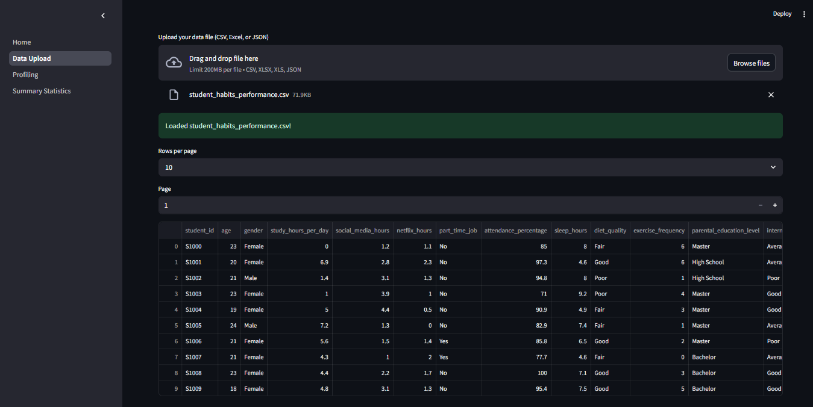

# DataMiner

[](LICENSE)
[](https://www.python.org/)
[](https://streamlit.io/)

**DataMiner** is a modern, interactive web application for data mining and machine learning workflows. Built with Streamlit, it empowers users to upload, inspect, and profile datasets, laying the foundation for advanced analytics and model building.

---

## 🚀 Features

- **Multi-page Streamlit app** with sidebar navigation
- **Single data upload**: Upload once, use everywhere
- **Paginated data preview**: Easily browse large datasets
- **Data profiling**: Instantly see shape, columns, and types
- **Summary statistics**: Numeric and categorical summaries, with clear explanations
- **Scalable architecture**: Ready for future ML and data transformation features

---

## 📸 Demo

| Page                | Screenshot Preview                                  |
|---------------------|-----------------------------------------------------|
| Home                |                       |
| Data Upload         |          |
| Data Upload (Paged) |      |
| Profiling           |              |
| Profiling (Types)   |          |
| Summary Statistics  |  |

---

## 🛠️ How It Works

1. **Upload Data**: Go to the "Data Upload" page and upload your CSV, Excel, or JSON file.
2. **Profile Data**: Navigate to "Profiling" to view dataset shape, columns, and data types.
3. **View Summary**: Check "Summary Statistics" for numeric and categorical summaries.
4. **Navigate Easily**: Use the sidebar to switch between features. Your uploaded data is available on all pages.

---

## 📁 Folder Structure

```
.
├── Home.py                  # Landing page
├── requirements.txt         # Python dependencies
├── pages/
│   ├── Data_Upload.py       # Upload and preview data
│   ├── Profiling.py         # Dataset profiling
│   └── Summary_Statistics.py# Summary statistics
```

---

## ✅ Progress Checklist

### Phase 1: Data Handling and Basic Preprocessing

- [x] Multi-page Streamlit app structure
- [x] Upload CSV, Excel, JSON files
- [x] Paginated data preview
- [x] Data profiling (shape, columns, types)
- [x] Summary statistics (numeric & categorical, with explanations)
- [x] Single upload shared across all pages

### Next Phases (Planned)

- [ ] Advanced data preprocessing (missing values, outliers, feature engineering)
- [ ] Data transformation (scaling, normalization, dimensionality reduction)
- [ ] Machine learning model training and evaluation
- [ ] Model export and deployment
- [ ] Results sharing and reporting

---

## 🛠️ Recent Issues Fixed

- [Summary statistics table shows many null values for non-numeric columns (#1)](https://github.com/Omar7001-B/data-miner/issues/1)
- [Improve dashboard navigation and layout for better usability (#2)](https://github.com/Omar7001-B/data-miner/issues/2)

---

## 📦 Requirements

- Python 3.9+
- streamlit
- pandas
- numpy
- openpyxl
- pyarrow

---

## 🤝 Contributing

Contributions are welcome!  
1. Fork the repo  
2. Create a feature branch  
3. Commit your changes  
4. Open a pull request

---

## 📄 License

This project is licensed under the MIT License.

## 🚦 How to Run

1. Clone the repository:
   ```bash
   git clone https://github.com/Omar7001-B/data-miner.git
   cd data-miner
   ```
2. Install dependencies:
   ```bash
   pip install -r requirements.txt
   ```
3. Start the app:
   ```bash
   streamlit run Home.py
   ```
4. Open your browser at [http://localhost:8501](http://localhost:8501) 